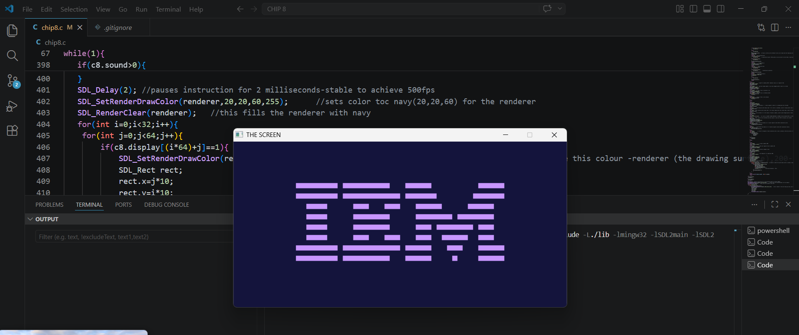

# 🕹️ CHIP-8 Emulator in C (SDL2)

A fully functional CHIP-8 emulator built from scratch in C using SDL2 for graphics and input handling.
This project was developed over 13 days as a deep dive into low-level systems programming and emulator design.

---

## 🚀 Overview

This emulator simulates the CHIP-8 virtual machine, including its memory, CPU, stack, timers, input system, and display.

It is capable of running classic CHIP-8 ROMs such as Pong,demonstrating correct opcode execution for supported instructions and real-time rendering.
---

## 🎯 Features

* ✅ Full fetch–decode–execute cycle implementation
* ✅ 4KB memory model with proper layout
* ✅ 16 general-purpose registers (V0–VF)
* ✅ Stack-based subroutine handling
* ✅ Delay and sound timers
* ✅ Hex keypad input mapped to keyboard
* ✅ Sprite rendering with collision detection
* ✅ SDL2-based graphics (64×32 display, scaled)

---

## 🧠 Architecture

### Memory Layout

* `0x000–0x1FF` → Reserved (interpreter space)
* `0x050–0x09F` → Fontset storage
* `0x200–0xFFF` → Program ROM

### Core Components

* **CPU** → Executes instructions using opcode decoding
* **Registers** → V0–VF (VF used as carry/collision flag)
* **Index Register (I)** → Memory addressing
* **Stack** → Stores return addresses for subroutines
* **Timers** → Delay and sound timers

---

## 🕹️ Controls

| CHIP-8 Key | Keyboard |
| ---------- | -------- |
| 0x0        | X        |
| 0x1        | 1        |
| 0x2        | 2        |
| 0x3        | 3        |
| 0x4        | Q        |
| 0x5        | W        |
| 0x6        | E        |
| 0x7        | R        |
| 0x8        | A        |
| 0x9        | S        |
| 0xA        | D        |
| 0xB        | F        |
| 0xC        | Z        |
| 0xD        | C        |
| 0xE        | V        |
| 0xF        | 4        |

---

## 🖥️ Demo

### IBM Logo Output


### Pong Running


## ⚙️ Build & Run

### Requirements

* GCC / Clang
* SDL2

### Build(Windows -MinGW)

```bash
gcc -o chip8 chip8.c -I./include -L./lib -lmingw32 -lSDL2main -lSDL2
```

### Run

```bash
./chip8
```

---

## 📂 Project Structure

```
.
├── chip8.c         # Core emulator implementation
├── roms/           # CHIP-8 ROM files
└── README.md
```

---

## 🔍 Key Implementation Details

* **Opcode Decoding**
  Implemented using bit masking techniques (`0xF000`, `0x0FFF`) to extract instruction components.

* **Sprite Rendering (`DXYN`)**
  Uses XOR drawing for pixel toggling and collision detection via register VF.

* **Timers**
  Delay and sound timers implemented using a fixed delay loop (approximate timing, pending precise 60Hz implementation).

* **Input Handling**
  Event-driven keyboard mapping using SDL2.

---

## 🧩 Challenges & Learnings

### Opcode Decoding

Decoding 16-bit instructions into meaningful operations required careful use of bit masking and shifting.
This improved my understanding of how instruction sets are structured and executed.

---

### Sprite Rendering & Collision Detection

Implementing `DXYN` involved handling bit-level graphics and screen wrapping.
Ensuring correct collision detection using XOR operations was a key challenge.

---

### Stack & Subroutine Handling

Managing nested subroutine calls required careful control of the stack pointer to avoid overflow and incorrect returns.

---

### Keypad Mapping

Mapping a hex-based virtual keypad to a physical keyboard required designing a consistent layout and handling both key press and release states.

---

### Low-Level Debugging

Debugging required manually tracking the program counter, registers, and memory state without high-level tools.
This significantly improved my ability to reason about program execution at a low level.

---

### Key Takeaway

This project helped me transition from writing programs to **understanding how a machine executes instructions**, including memory access, control flow, and hardware-level behavior.

---

## 🚧 Future Improvements

* [ ] Accurate 60Hz timer implementation
* [ ] Sound timer implemented (audio output pending)
* [ ] Configurable CPU speed
* [ ] Debug mode (step-by-step execution)
* [ ] ROM selection menu

---

## 📚 What I Learned

* Low-level memory management in C
* Bitwise operations and instruction decoding
* Emulator architecture and CPU design
* Event-driven programming with SDL2
* Debugging state-based systems

---

## 📌 Author

**Sania Anees**
Computer Science Student

---

## ⭐ Support

If you found this project interesting, consider giving it a star ⭐
